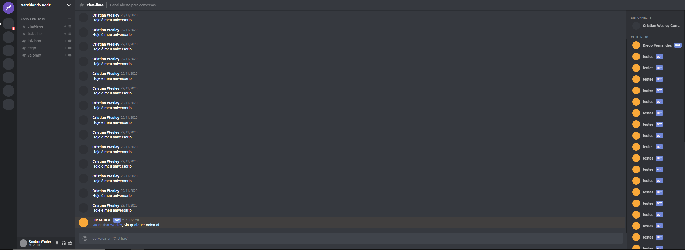

<h1 align="center"> UI Clone - Discord </h1>
<div align="center">
  
</div>
<p align="center">UI Clone do Discord para estudo.</p>

---

## 🚀 Indice

- 📓 [Sobre](#-Sobre)
- 👨‍💻 [Tecnologias utilizadas](#-Tecnologias-utilizadas)
- 📦 [Como baixar o projeto](#-Como-baixar-o-projeto)
- 🤝 [Considerações](#-Considerações)

## 📓 Sobre

Referência do projeto [Homepage da Tesla com ReactJS | UI Clone #14](https://www.youtube.com/watch?v=Mf4Se4ZGcG8&list=PL85ITvJ7FLohTZv9cC5-PrZ39Q3cugWqp&index=4) da [Rocketseat](https://github.com/Rocketseat)

Uma aplicação desenvolvida em react com typescript, focada na interface e estilização da landingPage da TESLA, que busca fazer um clone o mais identifico possível através de css em formato de styled-components.

# 👨‍💻 Tecnologias utilizadas

- [ReactJS](https://pt-br.reactjs.org/)
- [TypeScritp](https://www.typescriptlang.org/)
- [Styled-components](https://styled-components.com/)
- [Css Grid Layout](https://www.origamid.com/projetos/css-grid-layout-guia-completo/)
- [styled-icons](https://styled-icons.js.org/)
  
---

## 📦 Como baixar o projeto

### Com [Yarn](https://yarnpkg.com/) :

```bash

 # Clonar o repositório
 $ git clone https://github.com/CristianWesleyFront/discord-reactts

 # Entrar no diretorio
 $ cd discord-reactts

 # Instalar as dependências
 $ yarn install

 # Iniciar o projeto
 $ yarn dev


```

### Com [Npm](https://www.npmjs.com/) :

```bash

 # Clonar o repositório
 $ git clone https://github.com/CristianWesleyFront/discord-reactts

 # Entrar no diretorio
 $ cd discord-reactts

 # Instalar as dependências
 $ npm i

 # Iniciar o projeto
 $ npm run dev


```

---

## 🤝 Considerações

#### Ideia do projeto : 
### Criador: https://github.com/guilhermerodz
